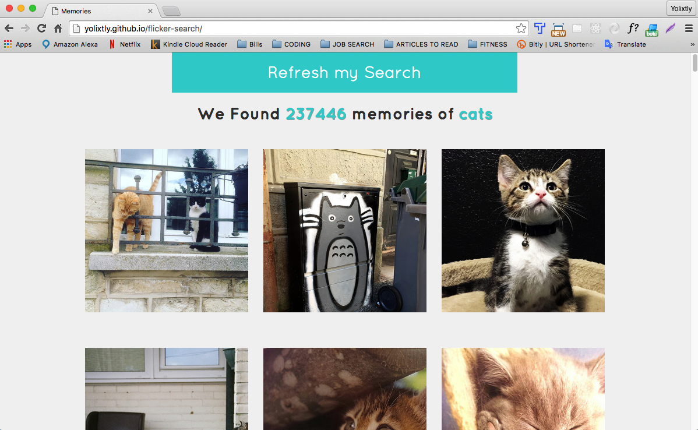

#Flicker-search App 
http://yolixtly.github.io/flicker-search/

About : 

- This App implements AngularJS and Flicker API. It is an image search engine called <em><strong>Memories</strong></em> . 

Bugs and Achievements: 

- Understanding how to make AJAX calls is a topic that I struggled in the past, however this project gave me the oportunity to dig deeper and feel more confident about it. 

- I am very proud of the simplicity of the design and the the theme; coding is creating a virtual world, why not make it attractive and fun! I make use of media-queries and bootstrap to achieve a <strong>responsive design</strong>. 

- At this point, I am still digesting the concept of $q service, I understand that it is being used implicity by the $http service, however I have seen the use of the $q service to create a new nested promise, which I dont understand 100%. My goal is to refactor the project and implement the $q service and timeouts. I think of $q service as a promise within a promise($http()). But what is the point? I believe that in the future with bigger projects, the concept of chainning events in sequence by using $q service will be more evident.

- The animations are very basic, and is a topic I want to master, I want my users to love the experience in each app I create.

-A constant topic of improvement in my projects are to keep indentation, white spaces and syntax with consistency, also in the first commits, I was making use of a lot of <em>!important</em> tags, which is now fixed 95% .   

Desktop View: 
 

 

 
Mobile Landing Page: 
 

 

